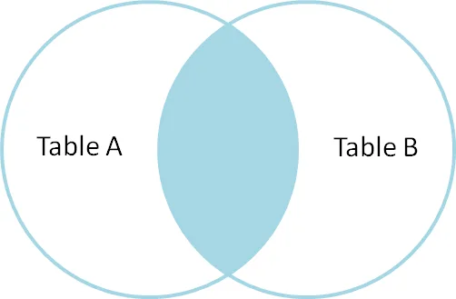
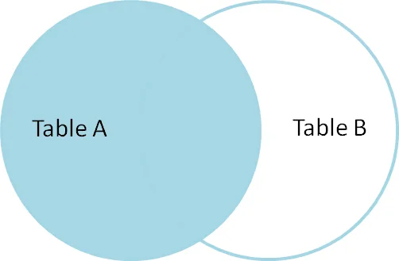
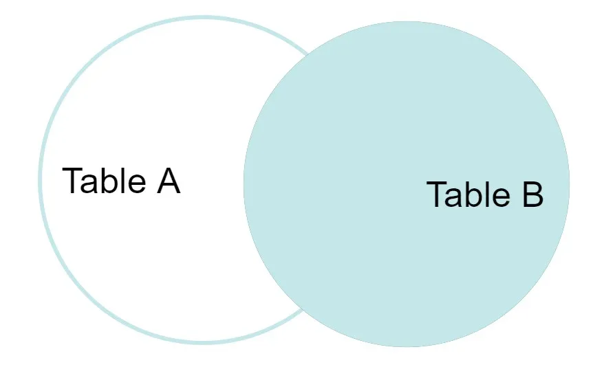
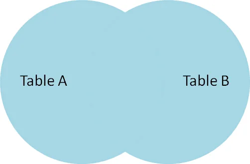
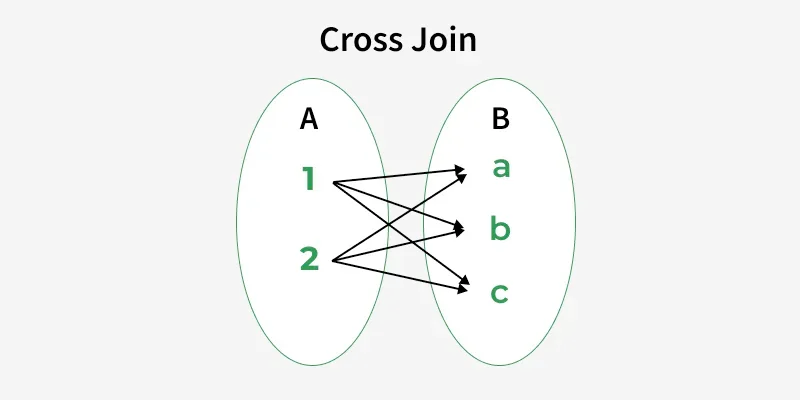

# SQL
 
## Execution order
1. `FROM` + `ON` + `JOIN`
2. `WHERE`
3. `GROUP BY` + Aggregate functions (e.g. `SUM`, `COUNT`, etc)
4. `HAVING`
5. `SELECT` + Scalar functions (e.g. `UPPER`, `LENGTH`, etc) + Window functions (e.g. `ROW_NUMBER`, `AVG`, etc)
6. `DISTINCT`
7. `ORDER BY`
8. `LIMIT`/`OFFSET`

### 1 - `FROM` + `ON` + `JOIN`
#### `FROM` - Identify data source
Engine determines the base tables/data sources (tables, views, subqueries)

#### `ON` - Filter `JOIN` conditions
Engine filters rows from the right-hand table **before** joining data

💡 This reduce the dataset **before** joining data, which can be critial for performance ! 

#### `JOIN` - Combine tables
Engines combines rows from left-hand and right-hand tables, based on join type (e.g. `LEFT JOIN`, `RIGHT JOIN`, `INNER JOIN`, etc)

### 2 - `WHERE` - Filter rows before aggregation
Engine excludes rows not matching the conditions, **before** any aggregation

⚠️ `WHERE` can't rely on aliases from `SELECT`, as it will be managed later !

### 3 - `GROUP BY` - Aggregate data into groups
Engines groups rows still available (=not excluded by previous steps).

ℹ️ This is when the **aggregate** functions from `SELECT`/`HAVING`/`ORDER BY`/... clauses are computed, **for each group**

### 4 - `HAVING` - Filter aggregated groups
Engines filters groups created by `GROUP BY`, using aggregated results.

💡 This is essentially a `WHERE` clause but performed on each group rather than each rows

### 5 - `SELECT` - Compute values and build initial output
Engines computes values and returns the initial output.

ℹ️ This is when:
- Column aliases are defined
- **Scalar** functions are applied (e.g. `CONCAT`, `UPPER`, etc)
- **Window** functions are executed (e.g. `ROW_NUMBER`, `AVG`, etc)
- `CASE` statements are evaluated

Resulting aliases/outputs become available for the next steps.

💡 This is where **window** functions are executed, because they process **filtered** and **grouped** rows, generated from previous steps.

### 6 - `DISTINCT` - Remove duplicated rows
Engines drops duplicated rows based on the given condition(s).

⚠️ This is executed after the `SELECT` statement (=> aliases are available for instance), **BUT before** sorting. Which implies that user can't predict which row will be used for the final output !

### 7 - `ORDER BY` - Sort results
Engines sorts the dataset based on the given condition(s).

ℹ️ As column aliases and window functions results have been executed previously, they are available for `ORDER BY` clause (Unlike `WHERE` clause which is executed early in the process)

### 8 - `LIMIT`/`OFFSET` - Restrict resulting rows
Engine looks for rows starting from `OFFSET` and includes only row count defined by `LIMIT` clause.


## Common

### DISTINCT
⚠️ Deduplicate rows based on every column ⚠️

💡 Use `DISTINCT ON (col1[, col2, ...])` to avoid unnecessary computation overhead

### HAVING
⚠️ Prefer `WHERE` clause when doable => `HAVING` is more costly ⚠️

"The `HAVING` clause is used after aggregation and can be less efficient." (https://www.geeksforgeeks.org/sql/sql-performance-tuning/)

## CTE
Common Table Expression
Ex: `With`

### WITH
-> Usable with `SELECT`, `DELETE`, `INSERT` or `UPDATE`
```sql
WITH cte_1 (col1, col2) AS (
    SELECT col1, SUM(a_col)
    FROM a_table
    GROUP BY col1
),
    cte_2 (col1) AS (
    SELECT avg(a_col)
    FROM a_table
)
    SELECT cte_1.col1
    FROM cte_1, cte_2
    WHERE cte_1.col2 > cte_2.col1;
```
```sql
WITH cte_1 AS (
    SELECT col1, SUM(a_col) AS col2
    FROM a_table
    GROUP BY col1
),
    cte_2 AS (
    SELECT avg(a_col) AS col1
    FROM a_table
)
    SELECT cte_1.col1
    FROM cte_1, cte_2
    WHERE cte_1.col2 > cte_2.col1
;
```

## JOIN CLAUSES

### JOIN / INNER JOIN
The INNER JOIN keyword selects all rows from both the tables as long as the condition is satisfied. 

This keyword will create the result set by combining all rows from both the tables where the condition satisfies i.e value of the common field will be the same.
```sql
SELECT table1.column1,table1.column2,table2.column1 
FROM table1 
    INNER JOIN table2 ON table1.matching_column = table2.matching_column
;
```


### LEFT JOIN / LEFT OUTER JOIN
A LEFT JOIN returns all rows from the left table, along with matching rows from the right table. 

**If there is no match, NULL values are returned for columns from the right table**
````sql
SELECT table1.column1,table1.column2,table2.column1
FROM table1 
    LEFT JOIN table2 ON table1.matching_column = table2.matching_column
;
````


### RIGHT JOIN / RIGHT OUTER JOIN
RIGHT JOIN returns all the rows of the table on the right side of the join and matching rows for the table on the left side of the join.

**It is very similar to LEFT JOIN for the rows for which there is no matching row on the left side, the result-set will contain null.**
````sql
SELECT table1.column1,table1.column2,table2.column1
FROM table1 
    RIGHT JOIN table2 ON table1.matching_column = table2.matching_column
;
````


### FULL JOIN
FULL JOIN creates the result-set by combining results of both LEFT JOIN and RIGHT JOIN. The result-set will contain all the rows from both tables. 

**For the rows for which there is no matching, the result-set will contain NULL values.**
````sql
SELECT table1.column1,table1.column2,table2.column1
FROM table1 
    FULL JOIN table2 ON table1.matching_column = table2.matching_column
; 
````


### NATURAL JOIN
A Natural Join is a type of INNER JOIN that automatically joins two tables based on columns with the same name and data type. 

It returns only the rows where the values in the common columns match.
````sql
SELECT table1.column1,table1.column2,table2.column1
FROM table1
    NATURAL JOIN table2
;
````
Assuming `table1` and `table2` have two common columns (e.g `column1` and `column3`), query above can be rewritten to
````sql
select table1.column1,table1.column2,table2.column1
FROM table1
    INNER JOIN table2 ON table1.column1 = table2.column1 AND table1.column3 = table2.column3
;
````

### CROSS JOIN
CROSS JOIN in SQL generates the **Cartesian product** of two tables, meaning **each row from the first table is paired with every row from the second**. 

This is useful when you want all possible combinations of records.

````sql
SELECT table1.column1,table1.column2,table2.column1
FROM table1 CROSS JOIN table2
;
````


/!\ Since result grows as `rows_in_table1 × rows_in_table2`, it can get very large, so it’s **best used with smaller tables** or **alongside a WHERE clause to filter results into meaningful pairs**.

=> CROSS JOIN with a `WHERE` actually becomes an INNER JOIN !

The following
````sql
SELECT table1.column1,table1.column2,table2.column1
FROM table1 CROSS JOIN table2
WHERE table1.matching_column = table2.matching_column
;
````
is the same as
````sql
SELECT table1.column1,table1.column2,table2.column1 
FROM table1 
    INNER JOIN table2 ON table1.matching_column = table2.matching_column
;
````

## WINDOW FUNCTIONS
See https://www.geeksforgeeks.org/sql/window-functions-in-sql/
```sql
SELECT column_name1, 
       window_function(column_name2) OVER ([PARTITION BY column_name3] [ORDER BY column_name4]) AS new_column
FROM table_name
;
```
Key Terms
 - `window_function`: Any aggregate or ranking function (`SUM()`, `AVG()`, `ROW_NUMBER()`, etc.)
 - `column_name1`: Regular column(s) to be selected in the output 
 - `column_name2`: Column on which the **window function is applied**
 - `column_name3`: Column used for **dividing rows into groups** (`PARTITION BY`)
 - `column_name4`: Column used to define order of rows **within each partition** (`ORDER BY`)
 - `new_column`: Alias for calculated result of the window function
 - `table_name`: table from which data is selected

### Aggregate Window Function
 - `SUM()`: Sums values within a window.
 - `AVG()`: Calculates the average value within a window.
 - `COUNT()`: Counts the rows within a window.
 - `MAX()`: Returns the maximum value in the window.
 - `MIN()`: Returns the minimum value in the window.
### Ranking Window Functions
 - `RANK()`: Assigns ranks to rows, **skipping ranks for duplicates**.
 - `DENSE_RANK()`: Assigns ranks to rows **without skipping rank numbers for duplicates**.
 - `ROW_NUMBER()`: Assigns a unique number to each row in the result set.
 - `PERCENT_RANK()`: Shows the relative rank of a row as a percentage between 0 and 1.
    
   

## Transations
```sql
BEGIN [TRANSACTION] [transaction_name];

ROLLBACK [TO SAVEPOINT SAVEPOINT_NAME];

COMMIT;
```

### Savepoints
A SAVEPOINT is used to create a checkpoint within a transaction. 

We can roll back to a specific SAVEPOINT instead of rolling back the entire transaction. 

This allows to undo part of the transaction rather than the entire transaction.

💡 See `SAVEPOINT` as an inner `BEGIN` !
````sql
SAVEPOINT SAVEPOINT_NAME;
````

#### Release savepoints
💡 See `RELEASE SAVEPOINT` as an internal `COMMIT` **just for the current inner transaction** !
````sql
RELEASE SAVEPOINT SAVEPOINT_NAME;
````

Example
````sql
BEGIN;
    INSERT INTO table1 VALUES (1);
    SAVEPOINT sp1; -- INNER BEGIN
        INSERT INTO table1 VALUES (2);
        SAVEPOINT sp2; -- INNER BEGIN
            INSERT INTO table1 VALUES (3);
        RELEASE SAVEPOINT sp2; -- Like a commit but only for the inner transaction 
        -- 💡 At this point, `sp1` is the current (inner) transaction (as `sp2` has been released) !
        INSERT INTO table1 VALUES ('NOT_A_NUMBER'); -- generates an error
````
In this example, the application requests the release of the savepoint `sp2`, **which inserted 3**. This changes the insert's transaction context to `sp1`. 

When the statement attempting to insert value `'NOT_A_NUMBER'` generates an error, the insertion of 2 and `'NOT_A_NUMBER'` are lost because they are in the same, now-rolled back savepoint, and value 3 is in the same transaction context.
